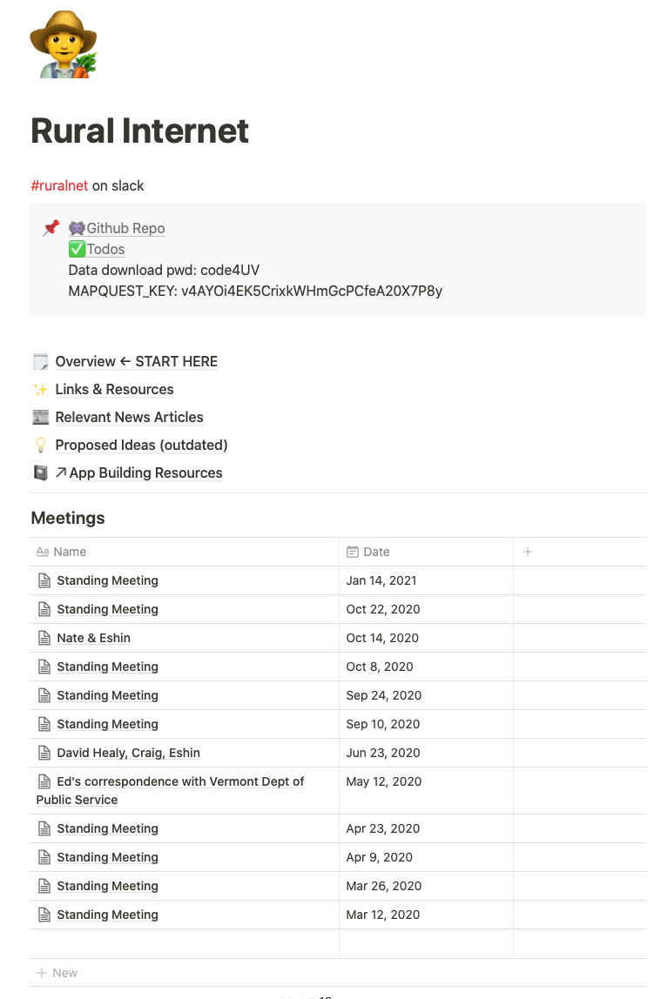

# Rural Net
## 👨‍🌾 👩‍🌾
### Code4UV
### Eshin Jolly 1/28/21

---

# Outline

- History & Goals
- "Deliverables"
- Current Approach
- Contribution needs
- Resources

---

# Project History 

Ed Childs raised the need for a solution help Corinth make a case for improved internet infrastructure. This was initially based on following the approach that was successful for Newbury.

We quickly realized many towns were facing a similar issue:  
to make a case for funding infrastructure improvement, they had to demonstrate that current ISP speed claims were misleading or failed to reflect experienced speeds.

--- 

# Project Goals

- Develop a web-application that can measure a user's internet speed easily while:
  - Respecting privacy (aggregated location); taking into account measurement variability (repeat testing, etc); making it easy to map measured speeds
- Survey users about their internet experience and satisfaction

---

# "Deliverables"

1. Speed-test web-app
2. User survey + results
3. Publicly available map comparing measured speeds to ISP reported speeds (Arlene)

---

# Current Approach

- Single-page-application built with [Svelte](https://svelte.dev)
- Backend using [LibreSpeed](https://github.com/librespeed/speedtest/tree/72cccd061961a7b3e2359e01b8d6a286a14a9450) for measurement
  - User downloads/upload random bytes of increasing size to measure speed
- Location gathered via Mapquest API
- Data stored in [Mongodb Atlas](https://www.mongodb.com/cloud) (cloud database)
- App served via [Heroku](https://dashboard.heroku.com) (auto-deploys from github)

---
# Project Needs

- [Github project board](https://github.com/codeforUV/ruralnet/projects/2)
  - general code cleanup; fixing some speedtest issues; styling webapp (Jennifer)
- Survey content finalization + integration with app logic and database
- Map generation
- Testing, testing, testing

--- 

# Resources

- [Notion](https://www.notion.so/codeforuv/Rural-Internet-143f869d1f6a47f899811de488431b36) just reach out if you haven't been invited yet
- Slack *#ruralnet* (same as above)
- [Github Repo](https://github.com/codeforUV/ruralnet/projects)
- [VT Dept of Public Service](https://publicservice.vermont.gov/content/broadband-availability) contains some statistics and maps from data provided by ISPs
- [Stone Environmental Maps](https://stone-env.maps.arcgis.com/home/item.html?id=1aadbcf8fe1848698db19b1e22456449) in particular the [broadband status 2019](https://stone-env.maps.arcgis.com/home/webmap/viewer.html?useExisting=1&layers=cba0c7919d1c4645a867d7d43250a3f4) and [broadband status 2019 enhanced](https://stone-env.maps.arcgis.com/home/webmap/viewer.html?useExisting=1&layers=cba0c7919d1c4645a867d7d43250a3f4) maps
- [Underserved towns map](https://www.arcgis.com/apps/View/index.html?appid=0d9eafeea51544ea90920b319cf1f89e)
- [Newbury internet satisfaction survey](https://docs.google.com/forms/d/e/1FAIpQLSfLijW81lm_O_dLd5yvX-Nu4LrJtfFR9xPRsNimCRC81Qohqg/viewform)

---

# Quick Walkthrough
